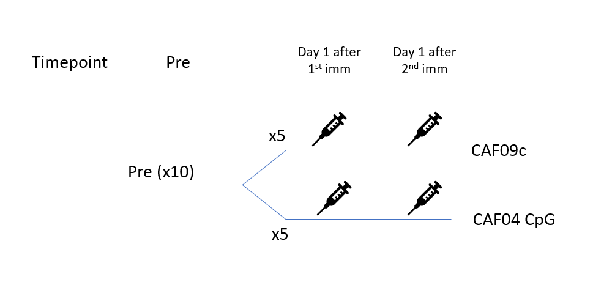

# INFIMM TB PAXGENE

Monkey blood PAXGENE tubes bulk RNA-seq analysis

## Info

### Study design

### Refernce genome and annotation
Species: Macaca fascicularis

Reference genome (MFA1912RKSv2) and annotation

* Ensembl genome assembilies: Macaca_fascicularis_6.0 (GCA_011100615.1) [Fasta file](https://ftp.ensembl.org/pub/release-109/fasta/macaca_fascicularis/dna/Macaca_fascicularis.Macaca_fascicularis_6.0.dna_rm.toplevel.fa.gz)

* Ensembl annotation release: 109. [gtf file]([https://ftp.ncbi.nlm.nih.gov/genomes/all/GCF/012/559/485/GCF_012559485.2_MFA1912RKSv2/GCF_012559485.2_MFA1912RKSv2_genomic.gtf.gz](https://ftp.ensembl.org/pub/release-109/gtf/macaca_fascicularis/Macaca_fascicularis.Macaca_fascicularis_6.0.109.gtf.gz)) 

## Data analysis (RNA-seq data)

| File                                      | Description                                  |
| ----------------------------------------- | -------------------------------------------- |
| analysis\0_generate_nextflow_input.R      | generate input file for nextflow             |
| analysis\1_RNA_SEQ_MAPPING.sh             | RNA-seq maaping by nf-core (STAR/Salmon)     |
| analysis\2_RNA_SEQ_MAPPING_SALMON.sh      | RNA-seq mapping by nf-core (only Salmon)     |
| analysis\3_RNAseq_data_cleaning.Rmd       | RNA-seq: data cleaning and QC                |
| analysis\4_RNAseq_downstream_analysis.qmd |                                              |
|                                           |                                              |
| analysis\6_correlation_late_response.qmd  | correlate early signature with late response |